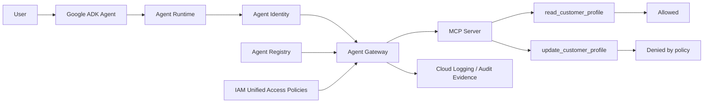
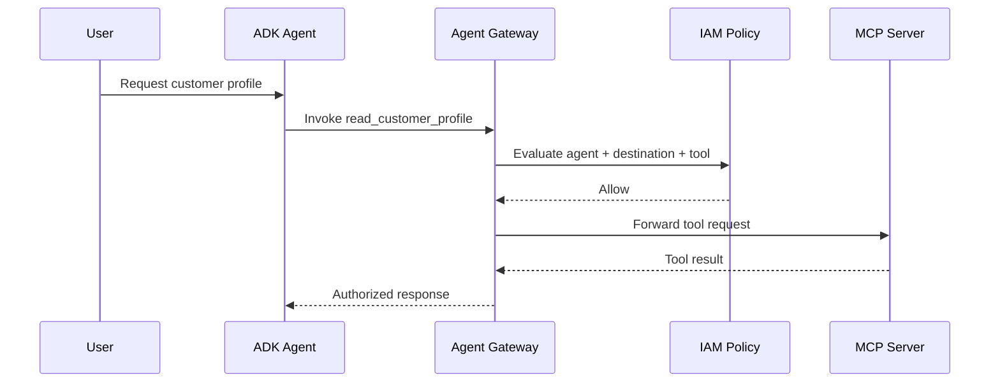
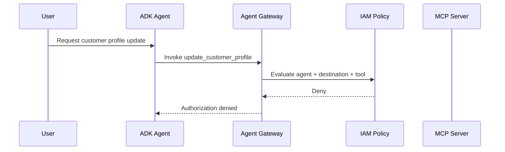

# Reference Architecture

This lab demonstrates policy-enforced access from a Google ADK agent to MCP tools through Google Cloud Agent Gateway.

## Architecture



## Component responsibilities

### Google ADK

Google Agent Development Kit is used to implement the agent.

ADK owns:

- agent behavior
- Gemini model interaction
- reasoning and orchestration
- deciding which tool it wants to invoke

ADK does not make the final authorization decision for a governed tool invocation.

### Gemini on Vertex AI

Gemini provides the model capability used by the ADK agent.

The model may determine that a particular tool call is appropriate for the user's request, but that decision does not grant permission to execute the tool.

### Agent Runtime

The ADK agent is deployed to Google Cloud Agent Runtime.

Agent Runtime provides the managed execution environment for the deployed agent.

### Agent Identity

The deployed agent operates with its own Agent Identity.

Agent Identity allows the agent to be evaluated as a distinct security principal.

This provides a clearer authorization boundary than using one broadly shared identity for multiple agents.

### Agent Registry

Agent Registry provides governed discovery and metadata for supported agentic resources and destinations.

Where appropriate, the MCP destination is registered so that discovery and governance remain separate from authorization.

Registration does not itself grant permission to invoke every tool exposed by the destination.

### Agent Gateway

Agent Gateway is the runtime enforcement boundary between the agent and the governed MCP destination.

Requests to the MCP server pass through the gateway before reaching the downstream tool.

This allows authorization policy to be evaluated outside the agent's reasoning loop.

### IAM Unified Access Policies

IAM Unified Access Policies determine which requests are allowed.

For this lab:

- `read_customer_profile` — allowed
- `update_customer_profile` — denied

The policy is first evaluated in dry-run mode and then moved to enforcement after validation.

### MCP server

The MCP server exposes two synthetic tools:

- `read_customer_profile`
- `update_customer_profile`

MCP defines how the tools are exposed and invoked.

MCP does not replace authentication or authorization.

### Cloud Logging and audit evidence

Logging provides evidence of the policy outcome.

For each governed request, the validation should make it possible to determine:

- which agent attempted the call
- which destination was requested
- which MCP tool was requested
- whether policy allowed or denied the request
- whether the downstream tool actually executed

## Allowed flow



Expected result:

**`read_customer_profile` executes successfully.**

## Denied flow



Expected result:

**`update_customer_profile` never reaches the MCP server.**

## Policy lifecycle

The lab uses the following policy lifecycle:

```text
Define
  ↓
Dry run
  ↓
Observe
  ↓
Validate
  ↓
Enforce
  ↓
Verify
```

Dry-run evaluation is important because policy behavior can be inspected before enforcement affects runtime traffic.

## Security boundary

The core boundary is:

> **The model proposes the action. The policy layer decides whether the action can execute.**

This prevents authorization from depending on prompt instructions or model behavior.

The agent can discover a tool and attempt to invoke it while the runtime authorization layer independently prevents execution.

## Design principles

### Separate reasoning from authorization

The agent's reasoning determines intent.

Authorization determines permission.

These should remain separate controls.

### Enforce least privilege per agent

Agent-specific identity allows access policy to reflect the responsibility of the individual agent.

### Authorize the actual tool call

Permission to reach an MCP destination should not automatically imply permission to invoke every tool exposed by that destination.

### Validate before enforcing

Policy changes should be tested in dry-run mode before moving into enforcement.

### Preserve evidence

Allowed and denied requests should leave enough evidence to reconstruct the authorization decision.

## Scope

This is a conceptual reference architecture for the lab.

The implementation will use synthetic data and publicly documented Google Cloud capabilities only.

It does not represent a customer environment or production deployment.